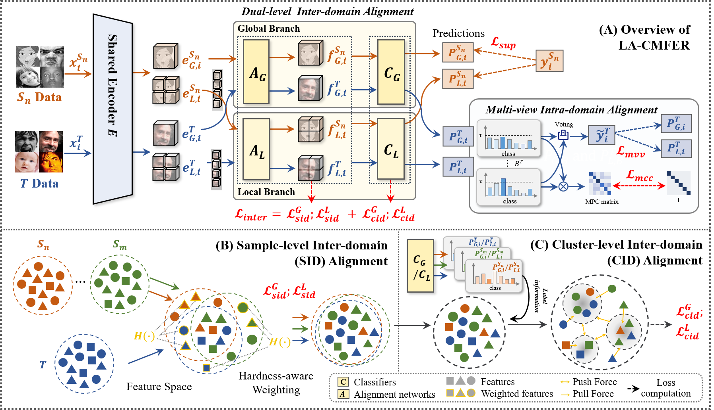

<div align="center">
<h2>LA-CMFER: Learning with Alignments: Tackling the Inter- and Intra-domain Shifts for Cross-multidomain Facial Expression Recognition</h2>

[**Yuxiang Yang**](https://scholar.google.com/citations?user=uyiHu0kAAAAJ&hl=en)<sup>1†</sup> · **Lu Wen**<sup>1†</sup> · [**Xinyi Zeng**](https://scholar.google.com/citations?user=LKWJyYsAAAAJ&hl=zh-CN&oi=sra)<sup>1</sup> · **Yuanyuan Xu**<sup>1</sup> · [**Xi Wu**](https://scholar.google.com/citations?user=to1L2HwAAAAJ&hl=en)<sup>2</sup> · **Jiliu Zhou**<sup>1</sup> · [**Yan Wang**](https://scholar.google.com/citations?user=f6FgQ_bXEb4C&hl=en)<sup>1*</sup>

<sup>1</sup>Sichuan University · <sup>2</sup>Chengdu University of Information

<sup>†</sup>equal contribution, <sup>*</sup>corresponding authors

**MM 2024**
</div>

## 🚀 News
- **2024.07**  [**arXiv**](https://arxiv.org/pdf/2407.05688) preprint released. 
- **2024.07**  Code released.
- **2024.07**  LA-CMFER is accepted by MM 2024.

## 📝 Introduction
Facial Expression Recognition (FER) holds significant importance in human-computer interactions. Existing cross-domain FER methods often transfer knowledge solely from a single labeled source domain to an unlabeled target domain, neglecting the comprehensive information across multiple sources. Nevertheless, cross-multidomain FER (CMFER) is very challenging for (i) the inherent inter-domain shifts across multiple domains and (ii) the intra-domain shifts stemming from the ambiguous expressions and low inter-class distinctions. In this paper, we propose a novel Learning with Alignments CMFER framework, named LA-CMFER, to handle both inter- and intra-domain shifts. Specifically, LA-CMFER is constructed with a global branch and a local branch to extract features from the full images and local subtle expressions, respectively. Based on this, LA-CMFER presents a dual-level inter-domain alignment method to force the model to prioritize hard-to-align samples in knowledge transfer at a sample level while gradually generating a well-clustered feature space with the guidance of class attributes at a cluster level, thus narrowing the inter-domain shifts. To address the intra-domain shifts, LA-CMFER introduces a multi-view intra-domain alignment method with a multi-view clustering consistency constraint where a prediction similarity matrix is built to pursue consistency between the global and local views, thus refining pseudo labels and eliminating latent noise. Extensive experiments on six benchmark datasets have validated the superiority of our LA-CMFER.

## 💡 Method




## 🔧 Get Started

#### Installation and Data Preparation

Step 1: In order to infer your results, you should store the dataset according to the path described in the txt file in `./data`

Step 2:  run `train.py`.

## 🙏 Acknowledgement

This project is not possible without multiple great open-sourced code bases. We list some notable examples below.

- [MFSAN](https://github.com/easezyc/deep-transfer-learning)
- [AGLRLS](https://github.com/yao-papercodes/AGLRLS)
- [DUML](https://github.com/liuhw01/DUML)


## 📃 Bibtex

If this work is helpful for your research, please consider citing the following BibTeX entry.

```
@article{yang2024learning,
  title={Learning with Alignments: Tackling the Inter-and Intra-domain Shifts for Cross-multidomain Facial Expression Recognition},
  author={Yang, Yuxiang and Wen, Lu and Zeng, Xinyi and Xu, Yuanyuan and Wu, Xi and Zhou, Jiliu and Wang, Yan},
  journal={arXiv preprint arXiv:2407.05688},
  year={2024}
}
```
